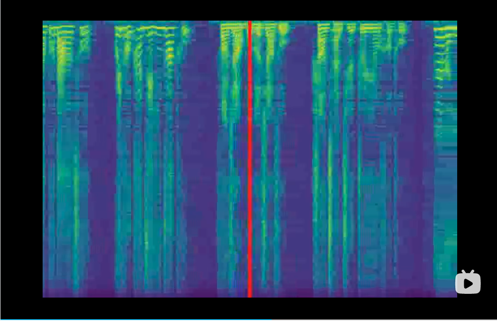

1. 训练代码是mainForAll.py
2. 运行代码是run_for_one_text.py 最上面输入语句即可.

需要下载的权重文件是.


| aishell3 | [link](https://zenodo.org/record/4912321#.YMN2-FMzakA) | [link](./examples/aishell3/config.yaml)|

下载后放项目根目录即可.


# Chinese mandarin text to speech (MTTS)

This is a modularized Text-to-speech framework aiming to support fast research and product developments. Main features include
- all modules are configurable via yaml,
- speaker embedding / prosody embeding/ multi-stream  text embedding are supported and configurable,
- various vocoders (VocGAN, hifi-GAN, waveglow, melGAN) are supported by adapter so that comparison across different vocoders can be done easily,
- durations/pitch/energy variance predictor are supported, and other variances can be added easily,
- and more on the road-map.

Contributions are welcome.

### Audio samples
Checkout the demo here
[](https://www.bilibili.com/video/BV14K4y1o7xC/)


- Interesting audio samples for aishell3 added [here](./docs/samples/aishell3).
- The <a href="https://ranchlai.github.io/mandarin-tts/">github page</a> also hosts some samples for  [biaobei](https://www.data-baker.com/en/#/data/index/source) and [aishell3](https://www.openslr.org/93/) datasets.


## Quick start

### Install

```
git clone https://github.com/ranchlai/mandarin-tts.git
cd mandarin-tts
git submodule update --force --recursive --init --remote
pip install -e .  # this is necessary!

```

### Training
Two examples are provided here: [biaobei](./examples/biaobei) and [aishell3](./examples/aishell3).

To train your own models, first make a copy from existing examples, then  prepare the melspectrogram features using [wav2mel.py](./examples/wav2mel.py) by
``` sh
cd examples
python wav2mel.py -c ./aishell3/config.yaml -w <aishell3_wav_folder> -m <mel_folder> -d cpu
```

prepare the scp files necessary for training,
``` sh
cd examples/aishell3
python prepare.py --wav_folder <aishell3_wav_folder>  --mel_folder <mel_folder> --dst_folder ./train/
```
This will generate scp files required by config.yaml (in the dataset/train section).
You would also need to check that everything is fine in the [config file](./examples/aishell3/config.yaml).
Usually you don't need to change the code.

Now you can start your training by
``` sh
cd examples/aishell3
python ../../mtts/train.py -c config.yaml -d cuda
```

For biaobei dataset, the workflow is the same, except that there is no speaker embedding but you can add prosody embedding.

More examples will be added. Please stay.

### Synthesize

#### Pretrained mtts checkpoints

Currently two examples are provided, and the corresponding checkpoints/configs are summarized as follows.

| dataset | checkpoint| config |
| --------------- | --------------- | --------------- |
| aishell3 | [link](https://zenodo.org/record/4912321#.YMN2-FMzakA) | [link](./examples/aishell3/config.yaml)|
| biaobei | [link](https://zenodo.org/record/4910507#.YMN29lMzakA) | [link](./examples/biaobei/config.yaml)|

#### Supported vocoders
Vocoders play the role of converting melspectrograms to waveforms. They are added as submodules and will be be trained in this project. Hence you should download the checkpoints before synthesizing. In training, vocoders are not necessary, as you can monitor the training process from generated melspectrograms and also the loss curve. Current we support the following vocoders,

| Vocoder | checkpoint| github |
| --------------- | --------------- | --------------- |
| Waveglow | [link](https://drive.google.com/file/d/1RxvxtOlzUUvUj2dAaBKgptHC6NyMqMm3/view?usp=sharing) | [link](https://github.com/ranchlai/waveglow.git)|
| hifi-gan | [link](https://drive.google.com/drive/folders/1-eEYTB5Av9jNql0WGBlRoi-WH2J7bp5Y) | [link](https://github.com/ranchlai/hifi-gan)
| VocGAN |[link](https://drive.google.com/file/d/1nfD84ot7o3u2tFR7YkSp2vQWVnNJ-md_/view) [link](https://zenodo.org/record/4743731/files/vctk_pretrained_model_3180.pt)|[link](https://github.com/ranchlai/VocGAN) |
| MelGAN |[link](https://drive.google.com/drive/folders/1tcg7ZK-X6RYM6-rB9_-CXvS4e_qwe_Z5?usp=sharing) |[link](https://github.com/ranchlai/melgan) |


All vocoders will be ready after running ```git submodule update --force --recursive --init --remote```. However, you have to download the checkpoint manually and properly set the path in the config.yaml file.

#### Preparing your input text

The [input.txt]('./examples/aishell3/input.txt) should be consistent with your setting  of emb_type1 to emb_type_n in config file, i.e., same type, same order.

To facilitate transcription of hanzi to pinyin, you can try:
```
cd examples/aishell3/
python ../../mtts/text/gp2py.py -t "为适应新的网络传播方式和读者阅读习惯"
>> sil wei4 shi4 ying4 xin1 de5 wang3 luo4 chuan2 bo1 fang1 shi4 he2 du2 zhe3 yue4 du2 xi2 guan4 sil|sil 为 适 应 新 的 网 络 传 播 方 式 和 读 者 阅 读 习 惯 sil
```
Not you can copy the text to [input.txt](./examples/aishell3/input.txt), and remember to put down the self-defined name and speaker id, separated by '|'.


#### Synthesizing your waves
With the above checkpoints and text ready, finally you can run the synthesis process,
``` sh
python ../../mtts/synthesize.py  -d cuda --c config.yaml --checkpoint ./checkpoints/checkpoint_1240000.pth.tar -i input.txt
```
Please check the config.yaml file for the vocoder settings.

If lucky, audio examples can be found in the [output folder](./examples/aishell3/outputs/).
"# 200_people_tts_chinese" 
